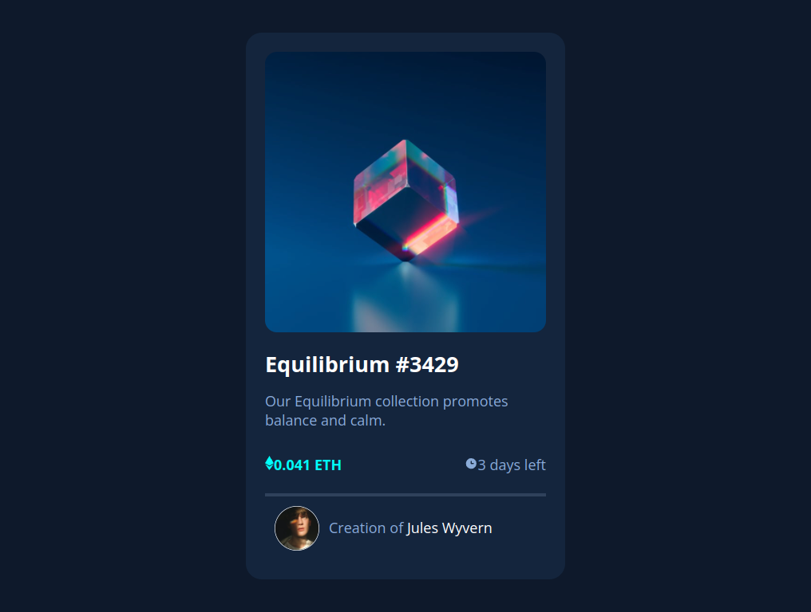

# Frontend Mentor - NFT preview card component solution

This is a solution to the [NFT preview card component challenge on Frontend Mentor](https://www.frontendmentor.io/challenges/nft-preview-card-component-SbdUL_w0U). Frontend Mentor challenges help you improve your coding skills by building realistic projects.

## Table of contents

- [Overview](#overview)
  - [The challenge](#the-challenge)
  - [Screenshot](#screenshot)
  - [Links](#links)
- [My process](#my-process)
  - [Built with](#built-with)
  - [What I learned](#what-i-learned)
- [Author](#author)

## Overview

### The challenge

Users should be able to:

- View the optimal layout depending on their device's screen size
- See hover states for interactive elements

### Screenshot



### Links

- Solution URL: [Solution](https://www.frontendmentor.io/solutions/nft-preview-card-solution-by-mohammad-reza-SJDE8Q0fc)
- Live Site URL: [Live](https://reza-salemi.netlify.app/)

## My process

### Built with

- Semantic HTML5 markup
- CSS custom properties
- Flexbox
- CSS Grid

### What I learned

I have learned how to use Pseudo-element.
Also, I have Realised when should use section tag

```html
<section class="content">
  <h2>Equilibrium #3429</h2>
  <p class="text">Our Equilibrium collection promotes balance and calm.</p>
</section>
```

```css
.cube-image::after {
  content: url(../images/icon-view.svg);
  background-color: hsla(178, 100%, 50%, 0.5);
```

## Author

- LinkedIn - [Mohammad Reza Salemi](https://www.linkedin.com/in/msalemi)
- Frontend Mentor - [@reza-salemi](https://www.frontendmentor.io/profile/reza-salemi)
